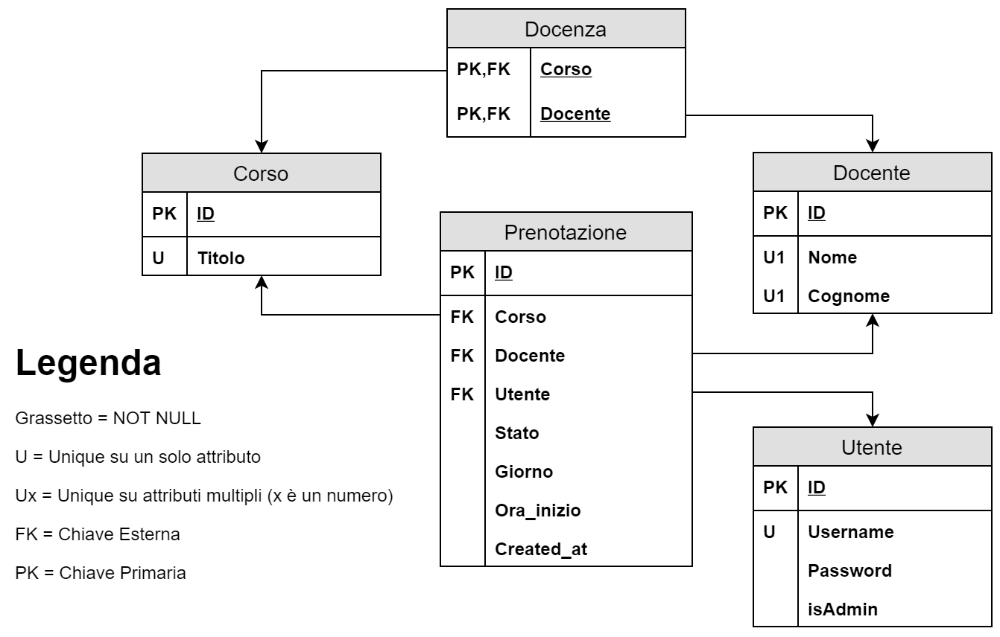

# IUM-TWEB-DB
Database usato nel progetto di Tecnologie Web e Interazione Uomo Macchina dell'Università degli Studi di Torino (2018-2019).

# Schema Relazionale

Di seguito lo schema del database:

